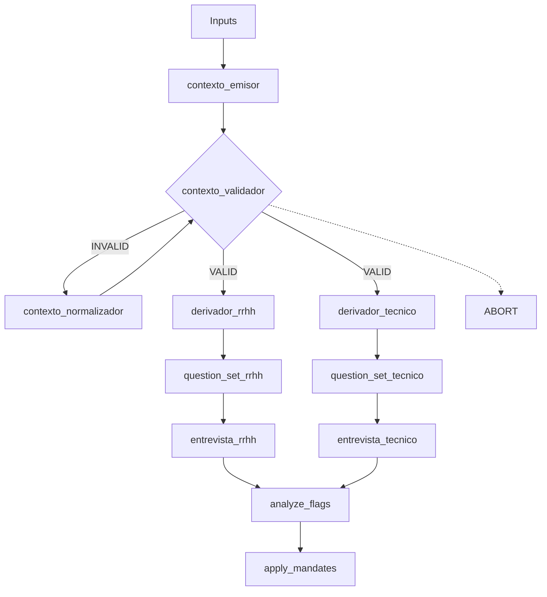

# flow_v1.1

## Diagrama de Flujos

ABORT solo tras 3 INVALID consecutivos

## Descripción de Componentes

- contexto_emisor → Inputs → ContextPack_BASE
- contexto_validador → ContextPack_BASE → VALID | INVALID
- contexto_normalizador → ContextPack_BASE → ContextPack_BASE
- derivador_rrhh → ContextPack_BASE → ContextPack_RRHH
- derivador_tecnico → ContextPack_BASE → ContextPack_TECNICO
- question_set_rrhh → ContextPack_RRHH → QuestionSet_RRHH
- question_set_tecnico → ContextPack_TECNICO → QuestionSet_TECNICO
- entrevista_rrhh → QuestionSet_RRHH → Transcript_RRHH
- entrevista_tecnico → QuestionSet_TECNICO → Transcript_TECNICO
- analyze_flags → Transcripts → Flags
- apply_mandates → Flags → Mandatos

## Reglas de error y abortos (flow_v1.1)

**Definir qué pasa cuando algo falla. Sin contratos.**

### Abortos

- ABORT si:
  - contexto_validador devuelve INVALID tras 3 ciclos consecutivos.
- En ABORT:
  - No hay derivación.
  - No se generan QuestionSets.
  - No se realizan entrevistas.
  - No se crean flags.

### Continuaciones

- Si el validador reporta VALID:
  - RRHH y Técnico corren en paralelo.
  - El fallo en uno no bloquea el avance del otro.

### Silencio

- El flow no explica errores.
- No existe retry fuera del normalizador.

### Regla SK

- El planner solo decide llamadas.
- Las funciones no gestionan el flujo.

## Versionado

- flow_v1.1 = estable, cerrado.
- Cambios estructurales ⇒ v1.2 / v2.
- Cambios de texto/claridad ⇒ misma versión.

**Regla:**  
Si cambia el diagrama o el orden, se debe subir la versión.

## Reglas de naming (reglas duras)

### Agentes / funciones

- Formato: snake_case
- Patrón: verbo + objeto
- Sin prefijos (ej: agent_, sk_, etc.)

**Ejemplos válidos:**

- contexto_emisor
- contexto_validador
- derivador_tecnico
- apply_mandates

### Artefactos

- Formato: PascalCase
- Sufijo claro

**Ejemplos válidos:**

- ContextPack_BASE
- QuestionSet_RRHH
- Transcript_TECNICO
- Flags
- Mandatos

### Archivos

- flow: flow_v1.1.md
- prompts: mismo nombre que función, ej: contexto_emisor.md

**Regla SK:**  
El nombre de la función ES el skill.  
No se permiten alias ni traducciones.

## Estado y Versionado

- STATUS: FROZEN
- VERSION: v1.1

**Cualquier cambio en el grafo, orden o nodos implica nueva versión.**
