# Flujo de Entrevistas

El propósito de este flujo es servir como herramienta de apoyo para entrevistas, además de resultar la base para avanzar hacia un auditor de proyectos.

## INPUTS
- **CV**: Trayectoria y experiencia declarada.
- **README(s)**: Contexto técnico de proyectos específicos.
- **Docs (0..n)**: Documentación técnica adicional, especificaciones o correos de contexto.

---

## REGLAS

### Reglas Generales
- **Prioridad**: RRHH precede a la entrevista técnica.
- **No Consejo**: Ningún agente aconseja al candidato ni al entrevistador.
- **No Decisión**: Los agentes no deciden aptitud; exponen datos.
- **Corrección ≠ Explicación**: Los agentes de corrección mandan acciones, no explican teoría.

### Reglas Absolutas (Orquestación)
- **Autoridad**: Solo el agente `contexto_emisor` puede crear o modificar `ContextPack_BASE`.
- **Validación Obligatoria**: Todo `ContextPack_BASE` DEBE pasar por `contexto_validador`. No existe BASE "provisional".
- **Bloqueo**: Si `ContextPack_BASE` no es `VALID`, está prohibido ejecutar cualquier agente derivado.
- **Ciclo de Corrección**: Si el validador devuelve `INVALID`, se ejecuta el `normalizador` (máximo 3 ciclos) antes de abortar.
- **Inmutabilidad**: Los agentes derivados (RRHH/Técnico) son de solo lectura; no pueden corregir ni completar la BASE.

---

## FLUJO DE TRABAJO

```mermaid
graph TD
    IN[INPUTS: CV, README, Docs] --> C_EMIT[1a. Contexto Emisor]
    C_EMIT --> C_VAL{1b. Validador}
    C_VAL -- INVALID --> C_NORM[1c. Normalizador]
    C_NORM --> C_VAL
    C_VAL -- VALID --> DERIVE[1d. Derivación]
    
    subgraph "Fase de Derivación"
    DERIVE --> DER_RRHH[Derivador RRHH]
    DERIVE --> DER_TEC[Derivador Técnico]
    end

    DER_RRHH --> Q_RRHH[2R. Question Set RRHH]
    DER_TEC --> Q_TEC[2T. Question Set Técnico]

    Q_RRHH --> I_RRHH[3R. Entrevista RRHH]
    Q_TEC --> I_TEC[3T. Entrevista Técnica]

    I_RRHH --> ANA[4. Análisis: Flags]
    I_TEC --> ANA

    ANA --> COR[5. Corrección: Mandatos]
```

---

## DETALLE DE AGENTES

### (1) Fase de Contexto (Orquestada)
1. **Emisor**: Genera el `ContextPack_BASE` consolidando todos los inputs.
2. **Validador/Normalizador**: Asegura que la BASE sea conforme al esquema y no tenga ambigüedades críticas.
3. **Derivadores**: Generan vistas filtradas (`ContextPack_RRHH` y `ContextPack_TÉCNICO`) para los siguientes agentes.

### (2) Generadores de Preguntas (QuestionSet)
- **RRHH / Técnico**: Generan un set cerrado y versionado de preguntas basado en su ContextPack derivado.

### (3) Agentes de Entrevista (Transcript)
- Ejecutan la entrevista siguiendo el `QuestionSet` y generan el `Transcript` (transcripción) de la sesión.

### (4) Agente de Análisis (Flags)
- Detecta desviaciones, ambigüedad y falta de cierre comparando los `Transcripts` con el `ContextPack_BASE`.
- **Output**: `Flags` (YAML).

### (5) Agente de Corrección (Mandatos)
- Emite instrucciones directas y concretas de corrección basadas en los `Flags` detectados.
- **Output**: `Mandatos` (YAML).

---

## ESTRUCTURA DEL PROYECTO

- **data/**: Documentos de entrada (CVs, correos, READMEs).
- **orquestration/**: Definición de flujos y reglas de control (no agentes).
- **prompts/**: Prompts del sistema organizados por fase (contexto, entrevista, análisis, etc.).
- **runs/**: Resultados de ejecuciones (logs, YAMLs generados).
- **schemas/**: Definiciones de contrato y esquemas de datos (Markdown/YAML).

---

## CONTEXTPACKS

### ContextPack_BASE
- Hechos relevantes, decisiones técnicas citadas, supuestos implícitos, cronología y señales de riesgo. Es la única fuente de verdad.

### ContextPack_RRHH (Derivado)
- **Incluye**: Coherencia, trayectoria, decisiones no técnicas, estabilidad.
- **Excluye**: Detalle técnico profundo.

### ContextPack_TÉCNICO (Derivado)
- **Incluye**: Criterio técnico, trade-offs, profundidad conceptual, decisiones de diseño.
- **Excluye**: Narrativa personal o emocional.
